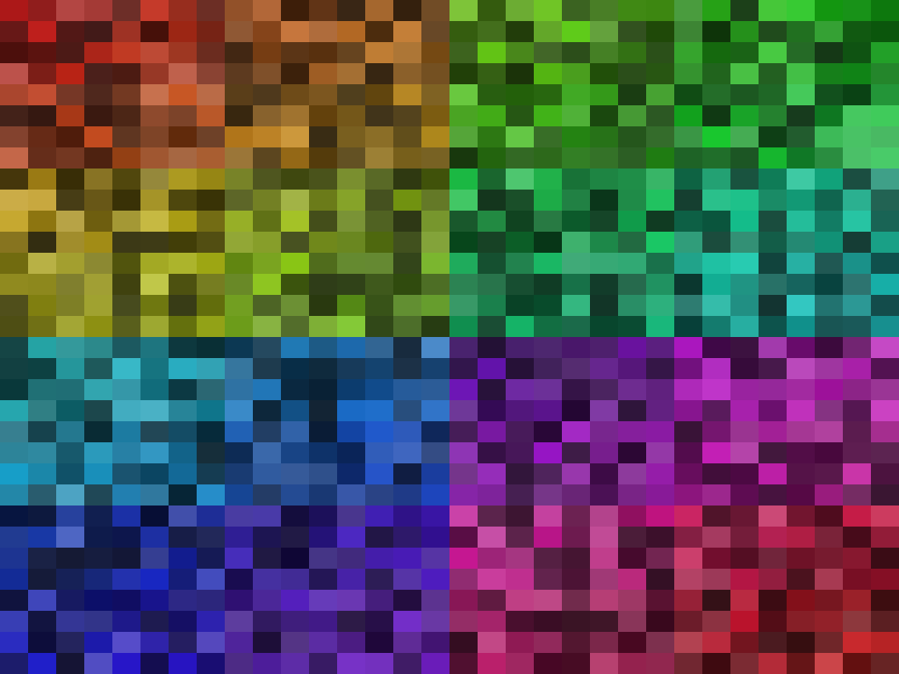

# Tiled image generator

## Example usage

```commandline
python -m tile-image-generator hierarchical --depth 5 1024 768 \
    --min-saturation 0.6 --max-saturation 0.9 \
    --min-value 0.2 --max-value 0.8
```

And the output will look something like this: 


